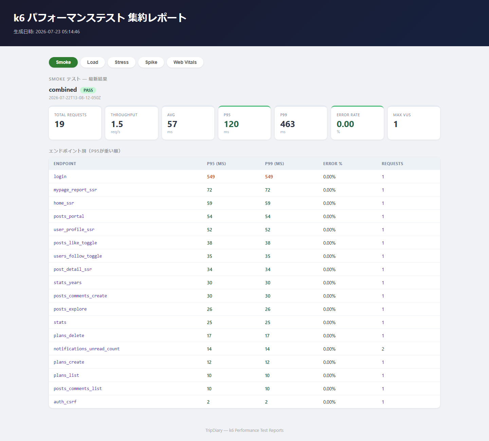
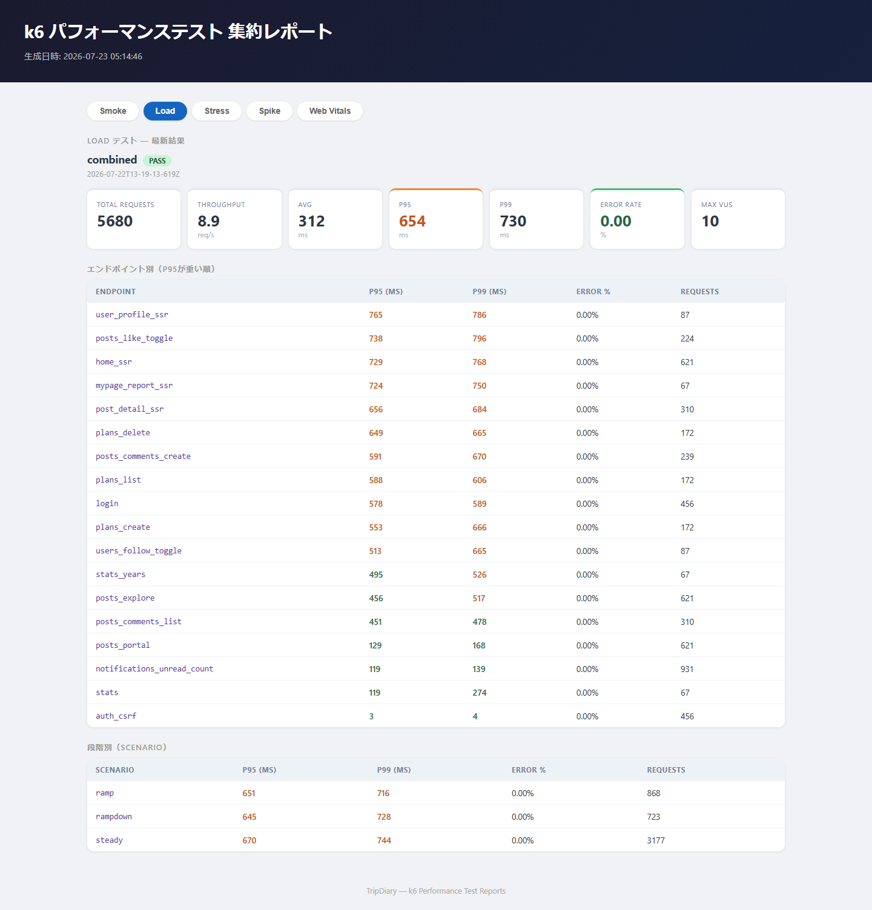
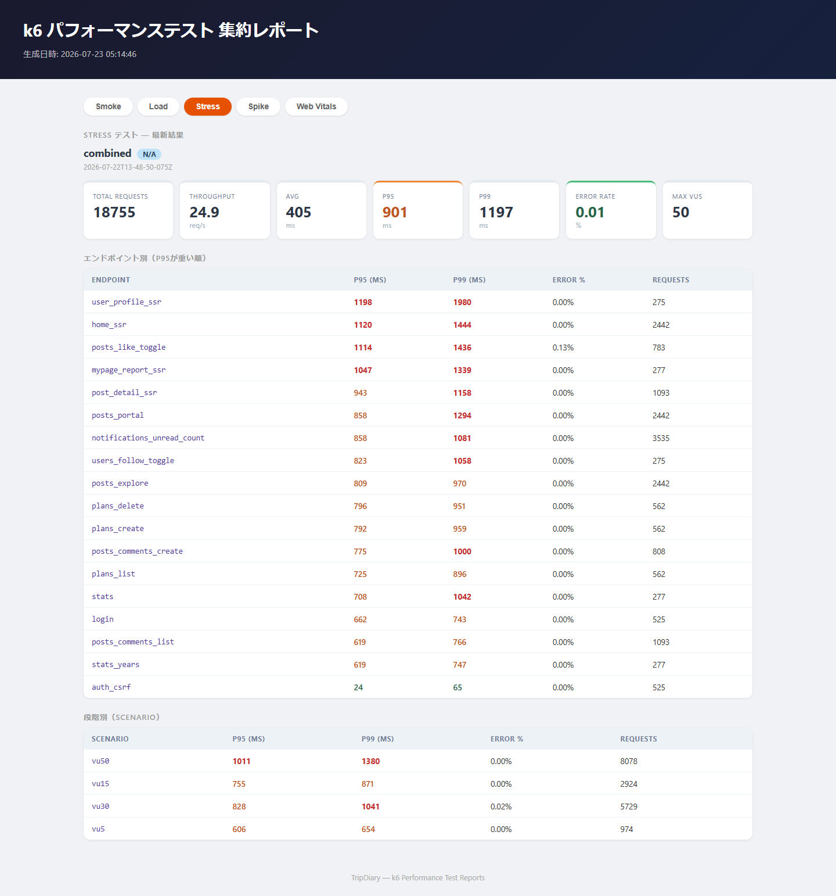
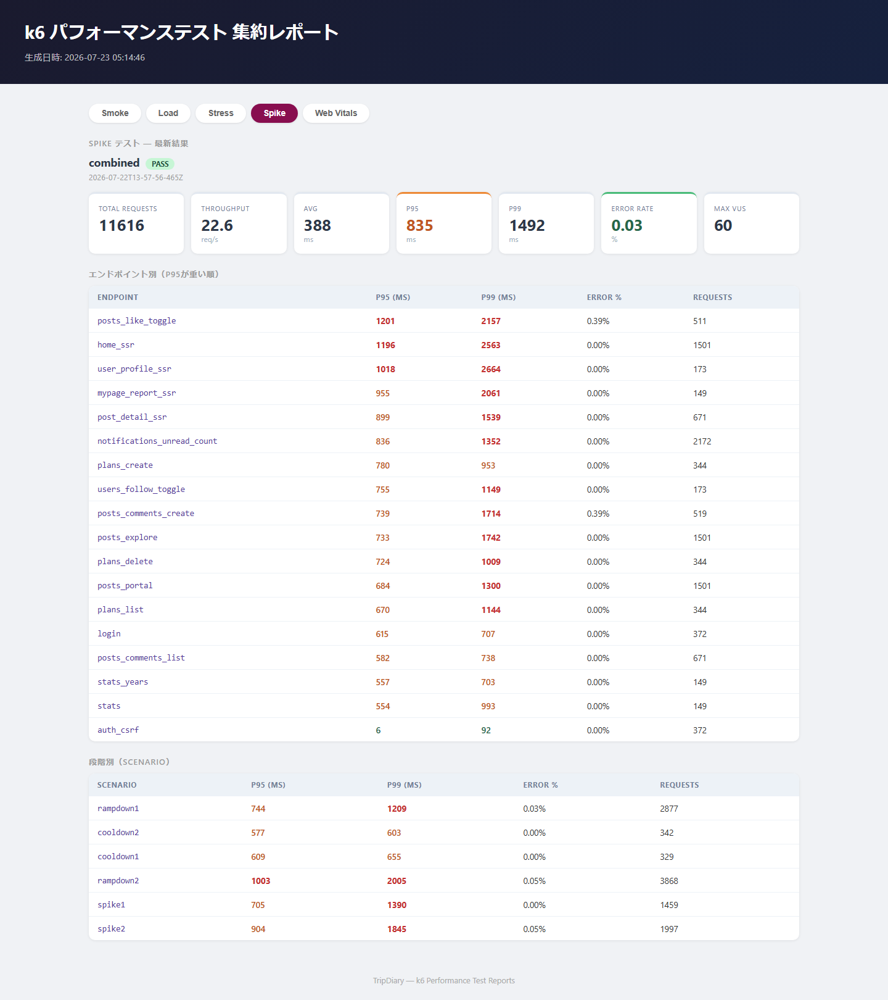
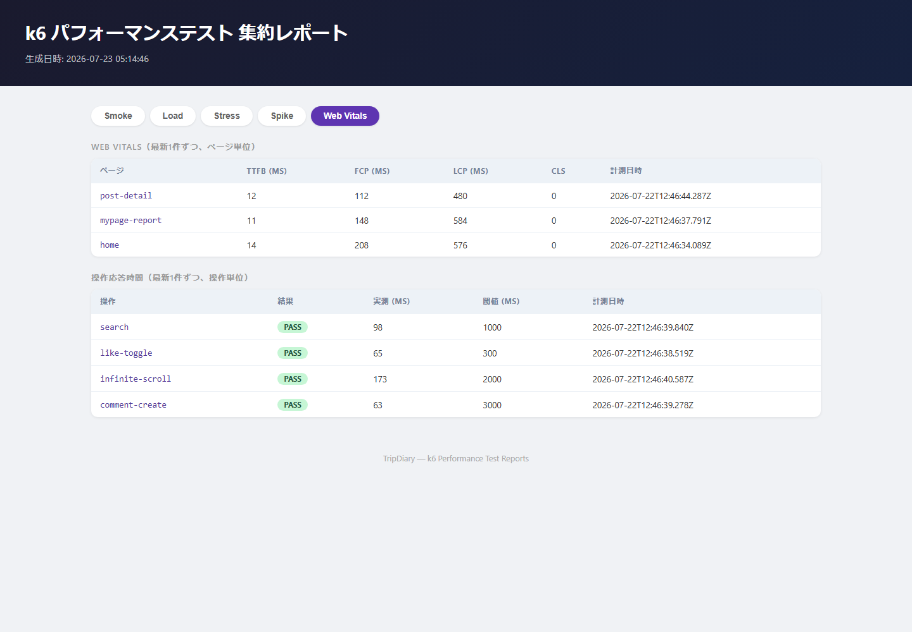

# TripDiary

旅行スポットを記録・共有できる SNS 型旅行記録アプリ。スポット投稿・写真共有・いいね・コメント・フォロー・エリアタグ絞り込み・訪問済み/行きたいリスト・簡易地図などのソーシャル機能を備える。

---

## 技術スタック

| 役割 | 技術・バージョン |
|------|----------------|
| フロントエンド | Next.js 16.2.10 + TypeScript |
| スタイリング | Tailwind CSS 4.3.2 |
| バックエンド | Next.js Route Handlers |
| ORM | Prisma 6.19.3 |
| 認証 | Auth.js（next-auth v5 beta.31） |
| データベース | MySQL（開発: Docker / 本番: AWS RDS 予定） |
| 画像ストレージ | ローカル保存（開発時点）→ AWS S3 移行予定（実装計画書 Phase 6） |
| 地図 | Leaflet + OpenStreetMap |
| ホスティング | 未デプロイ（想定構成: AWS EC2 + RDS + S3。詳細は [インフラ構成書](docs/インフラ構成書.md)） |

---

## 主な機能

| カテゴリ | 機能 |
|---------|------|
| 認証 | ユーザー登録 / ログイン / ログアウト |
| 投稿 | 旅行スポットの記録（場所名・感想・写真複数枚）/ 投稿編集 / 投稿削除 |
| いいね | 「行ってみたい」登録 / 取り消し / いいね数表示 |
| コメント | コメント投稿 / コメント一覧表示 / コメント削除 |
| フォロー | フォロー / アンフォロー / フォロワー・フォロー中数表示 |
| エリアタグ | エリアタグ付け / タグ別絞り込み表示 / 都道府県ドロップダウン選択（47都道府県＋海外）/ 検索のエリアタブで都道府県別絞り込み |
| リスト | 訪問済みリスト / 行きたいリスト の登録・管理 |
| 旅行プラン | 旅行計画の作成・管理 / スポット・予算内訳の記録 / 「この旅を記録する」投稿リンク / 完了管理 |
| 旅行レポート | 年別の旅まとめカード（Spotify Wrapped 風）/ カテゴリ・費用グラフ / 訪問都道府県一覧 / 年別タイムライン |
| 費用管理 | 投稿への費用内訳記録（自分のみ表示）/ プランへの予算内訳記録 |
| 地図 | 投稿スポットの位置情報表示（Leaflet + OpenStreetMap） |
| ユーザー | プロフィール表示 / TabiScore / コメント履歴 / プロフィール編集 / プロフィール画像アップロード |
| UI | スマートフォン・タブレット・PC に対応したレスポンシブレイアウト |

---

## パフォーマンステスト

perf専用MySQLへ再シードした環境で、k6による負荷試験とPlaywrightによるWeb Vitals計測を実施しています。詳細な実行手順・シナリオ・閾値は[performance/k6/README.md](performance/k6/README.md)を参照してください。

| 種別 | ピーク業務VU | 結果 | 主な実測値 |
|---|---:|---|---|
| Smoke | 1 | PASS | p95 120ms / p99 463ms / エラー率 0% |
| Load | 10 | PASS | steady p95 670ms / p99 744ms / エラー率 0% |
| Stress | 50 | N/A | vu50 p95 1011ms / p99 1380ms、全体エラー率 0.005% |
| Spike | 60 | PASS | cooldown p99 655ms / 603ms / エラー率 0.034% |

<details>
<summary>集約レポートのスクリーンショット</summary>










</details>

---

## ディレクトリ構成

```
TripDiary/
├── docs/                          # ドキュメント類
│   ├── 要件定義書.md
│   ├── DB設計書.md
│   ├── API仕様書.md
│   ├── テスト設計書.md
│   ├── ログ運用設計書.md
│   ├── 画面設計書.md
│   ├── 画面遷移図.md
│   ├── シーケンス図.md
│   ├── インフラ構成書.md
│   └── 機能定義書/
│       ├── 認証機能定義書.md
│       ├── 投稿機能定義書.md
│       ├── いいね機能定義書.md
│       ├── コメント機能定義書.md
│       ├── フォロー機能定義書.md
│       ├── エリアタグ機能定義書.md
│       ├── リスト機能定義書.md
│       ├── 地図機能定義書.md
│       ├── プロフィール機能定義書.md
│       ├── 旅行プラン機能定義書.md
│       ├── 旅行レポート機能定義書.md
│       └── 通知機能定義書.md
├── src/
│   ├── app/
│   │   ├── (auth)/                # 認証・サインアップ画面
│   │   ├── (app)/                 # 認証済み画面（サイドバーレイアウト）
│   │   ├── (public)/              # 未認証でも閲覧可能な画面（探索フィード・投稿詳細等）
│   │   ├── api/                   # Route Handlers
│   │   └── api-docs/              # Swagger UI（Phase 2.5-A）
│   ├── components/                # 共通コンポーネント
│   ├── lib/                       # ユーティリティ（prisma / auth / logger / openapi 等）
│   └── types/                     # 型定義
├── prisma/
│   └── schema.prisma
├── e2e/                           # Playwright E2Eテスト
├── public/
├── .env.local
├── .env.sample
└── package.json
```

---

## ローカル開発環境のセットアップ

### 前提条件

- Node.js 20 以上 / pnpm
- Docker（開発用MySQLコンテナの起動に使用）
- Leaflet + OpenStreetMap（APIキー不要）
- ※ AWS（S3等）は現時点では不要（画像はローカル保存。S3移行は実装計画書 Phase 6 で対応予定）

### 手順

```bash
# 1. リポジトリをクローン
git clone <repository-url>
cd TripDiary

# 2. 依存関係をインストール
pnpm install

# 3. 環境変数を設定
cp .env.sample .env.local
# .env.local を編集して各値を設定

# 4. 開発用DBを起動
docker compose up -d db

# 5. DB マイグレーション
pnpm prisma migrate dev

# 6. 開発サーバー起動
pnpm dev
```

| サービス | URL |
|---------|-----|
| アプリ | http://localhost:3000 |

---

## 主なコマンド

```bash
pnpm dev             # 開発サーバー起動
pnpm build           # 本番ビルド
pnpm lint            # ESLint 実行
pnpm typecheck       # 型チェック（tsc --noEmit）
pnpm prisma studio       # Prisma Studio（DB GUI）
pnpm prisma migrate dev  # マイグレーション実行

# テスト（詳細は docs/テスト設計書.md 参照）
pnpm test                    # Vitest（単体・統合テスト）を実行
pnpm test:coverage           # カバレッジ計測付きで実行
pnpm prisma:migrate:test     # テスト用DBにスキーマ適用（事前に docker compose up -d mysql-test が必要）
pnpm playwright test         # E2Eテスト（認証フロー・投稿の主要フロー）
```

### API仕様書（Swagger）

実装済みAPIの最新仕様は、開発サーバー起動中に以下で確認できる（Phase 2.5-Aで自動生成を導入）。

- Swagger UI: http://localhost:3000/api-docs
- OpenAPI JSON: http://localhost:3000/api/openapi.json

---

## 環境変数

`.env.sample` を参照して `.env.local` を作成する。

| 変数名 | 説明 |
|--------|------|
| `DATABASE_URL` | MySQL 接続 URL（開発時は `docker compose up -d db` のコンテナ、本番は AWS RDS 予定） |
| `AUTH_SECRET` | Auth.js のシークレットキー |
| `AUTH_URL` | アプリの URL（開発時は http://localhost:3000） |
| `AWS_REGION` | S3 バケットのリージョン（例: ap-northeast-1）※現時点では未使用（S3移行＝実装計画書 Phase 6 まで画像はローカル保存） |
| `AWS_S3_BUCKET_NAME` | S3 バケット名 ※現時点では未使用 |
| `AWS_ACCESS_KEY_ID` | IAM ユーザーのアクセスキー ※現時点では未使用 |
| `AWS_SECRET_ACCESS_KEY` | IAM ユーザーのシークレットキー ※現時点では未使用 |
| ~~`NEXT_PUBLIC_MAPBOX_TOKEN`~~ | 不要（Leaflet + OpenStreetMap に変更） |

---

## 本番環境へのデプロイ

現時点で本番デプロイは未実施（ローカル開発環境のみ）。本番環境は AWS EC2（アプリ）+ AWS RDS（MySQL）+ AWS S3（画像ストレージ）で構成予定。デプロイ手順・画像ストレージのS3移行は実装計画書 Phase 6 で実施する。インフラの詳細は [docs/インフラ構成書.md](docs/インフラ構成書.md) を参照。

---

## ドキュメント

| ドキュメント | 内容 |
|------------|------|
| [要件定義書](docs/要件定義書.md) | 機能要件・非機能要件・技術スタック |
| [DB 設計書](docs/DB設計書.md) | ER 図・テーブル定義 |
| [API 仕様書](docs/API仕様書.md) | エンドポイント一覧・リクエスト/レスポンス仕様 |
| [画面設計書](docs/画面設計書.md) | ワイヤーフレーム（全画面） |
| [画面遷移図](docs/画面遷移図.md) | 画面間の遷移フロー |
| [シーケンス図](docs/シーケンス図.md) | 認証・投稿・ソーシャル機能のシーケンス |
| [インフラ構成書](docs/インフラ構成書.md) | AWS（EC2 + RDS + S3）構成・デプロイフロー |
| [テスト設計書](docs/テスト設計書.md) | テスト方針・層別戦略・テストケース一覧（Phase 2.5-B） |
| [ログ運用設計書](docs/ログ運用設計書.md) | 構造化ログ方針・監視項目・障害対応フロー・エラー監視連携（Phase 2.5-C/D） |
| [認証機能定義書](docs/機能定義書/認証機能定義書.md) | 認証機能の詳細仕様 |
| [投稿機能定義書](docs/機能定義書/投稿機能定義書.md) | 投稿機能の詳細仕様 |
| [いいね機能定義書](docs/機能定義書/いいね機能定義書.md) | いいね機能の詳細仕様 |
| [コメント機能定義書](docs/機能定義書/コメント機能定義書.md) | コメント機能の詳細仕様 |
| [フォロー機能定義書](docs/機能定義書/フォロー機能定義書.md) | フォロー機能の詳細仕様 |
| [エリアタグ機能定義書](docs/機能定義書/エリアタグ機能定義書.md) | エリアタグ機能の詳細仕様 |
| [リスト機能定義書](docs/機能定義書/リスト機能定義書.md) | 訪問済み/行きたいリスト機能の詳細仕様 |
| [地図機能定義書](docs/機能定義書/地図機能定義書.md) | 地図表示機能の詳細仕様 |
| [プロフィール機能定義書](docs/機能定義書/プロフィール機能定義書.md) | プロフィール機能の詳細仕様 |
| [旅行プラン機能定義書](docs/機能定義書/旅行プラン機能定義書.md) | 旅行プラン機能の詳細仕様 |
| [旅行レポート機能定義書](docs/機能定義書/旅行レポート機能定義書.md) | 旅行レポート機能の詳細仕様 |
| [通知機能定義書](docs/機能定義書/通知機能定義書.md) | 通知機能の詳細仕様 |
