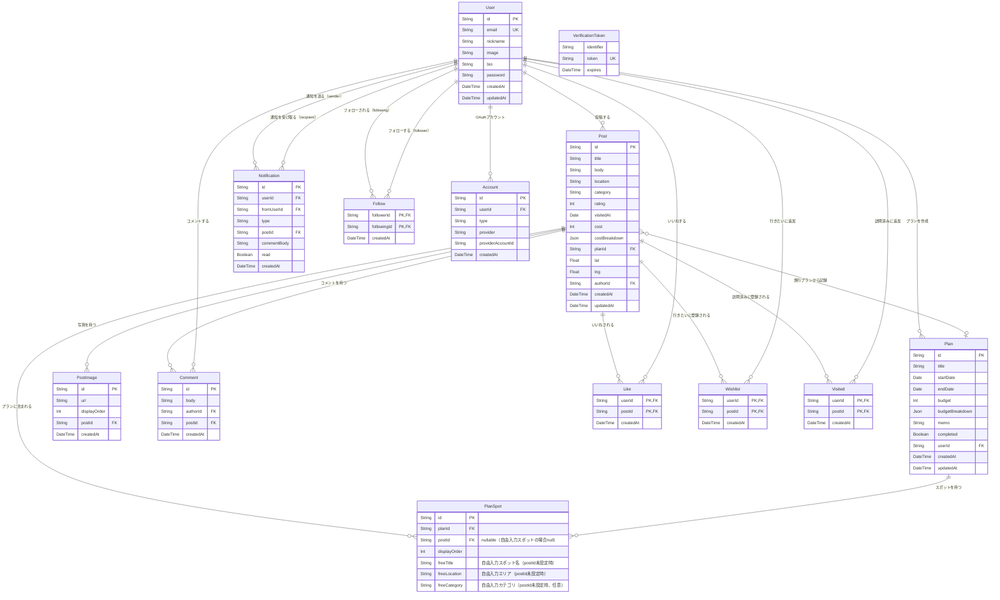

# TripDiary DB設計書

**バージョン:** 1.5
**作成日:** 2026-06-27
**更新日:** 2026-07-11
**作成者:** Nakata Saki

> ✅ **2026-07-11 更新：** `plan_spots`テーブルが実装と乖離していたため修正（複合主キー`(planId, postId)`→単一`id`主キー、`postId`をNULL許容化、自由入力スポット用の`freeTitle`/`freeLocation`/`freeCategory`を追加）。

---

## 1. 概要

### 1.1 設計方針

- 画像は AWS S3 に保存し、DB には URL のみ保持する
- いいね・フォロー・訪問済み・行きたいリストは複合主キーで一意性を管理する
- タイムスタンプは `createdAt` / `updatedAt` を全テーブルに持つ（`updatedAt` は変更があるテーブルのみ）
- 認証テーブル（Account・VerificationToken）は Auth.js v5 の仕様に準拠する（JWT Strategy のため Session テーブルは不要）
- 地図用の緯度・経度は Post テーブルに `lat` / `lng` として保持する

---

## 2. ER 図

---

## 3. テーブル定義書

### 3.1 users テーブル

| カラム名 | 型 | NULL | デフォルト | 説明 |
|---------|-----|------|-----------|------|
| id | VARCHAR(30) | NOT NULL | cuid() | ユーザーID（cuid） |
| email | VARCHAR(255) | NOT NULL | - | メールアドレス（一意） |
| nickname | VARCHAR(20) | NOT NULL | - | ニックネーム |
| image | TEXT | NULL | - | プロフィール画像URL（S3） |
| bio | VARCHAR(200) | NULL | - | 自己紹介文 |
| password | VARCHAR(255) | NULL | - | ハッシュ化済みパスワード（OAuth利用時はNULL） |
| createdAt | DATETIME(3) | NOT NULL | now() | 作成日時 |
| updatedAt | DATETIME(3) | NOT NULL | - | 更新日時 |

**制約**
- 主キー：`id`
- 一意制約：`email`

**インデックス**
| インデックス名 | カラム | 目的 |
|-------------|-------|------|
| users_email_key | email | メールアドレスによる検索 |

---

### 3.2 posts テーブル

| カラム名 | 型 | NULL | デフォルト | 説明 |
|---------|-----|------|-----------|------|
| id | VARCHAR(30) | NOT NULL | cuid() | 投稿ID（cuid） |
| title | VARCHAR(40) | NOT NULL | - | スポット名・タイトル（最大40文字） |
| body | TEXT | NOT NULL | - | 感想・説明文 |
| category | VARCHAR(50) | NULL | - | カテゴリ（観光/グルメ/宿・ホテル/自然/アクティビティ/歴史・文化/その他）。アプリレベルで値を制限 |
| rating | INT | NULL | - | 評価（1〜5）。アプリレベルで 1〜5 に制限 |
| visitedAt | DATE | NOT NULL | - | 訪問日（必須） |
| location | VARCHAR(50) | NOT NULL | - | エリア（値域：47都道府県＋「海外」）。旅行レポートの集計・検索エリアタブの絞り込みに使用。フィールド名は `location` だが実質的にエリア＋海外を表す |
| cost | INT | NULL | - | 費用合計（costBreakdown の自動集計値） |
| costBreakdown | JSON | NULL | - | 費用内訳。`[{"label":"交通費","amount":3000}, ...]` 形式。自分のみ表示 |
| planId | VARCHAR(30) | NULL | - | 旅行プランから投稿した場合のプランID |
| lat | FLOAT | NULL | - | 緯度（任意・地図ピン設置時に設定） |
| lng | FLOAT | NULL | - | 経度（任意・地図ピン設置時に設定） |
| authorId | VARCHAR(30) | NOT NULL | - | 投稿者のユーザーID |
| createdAt | DATETIME(3) | NOT NULL | now() | 作成日時 |
| updatedAt | DATETIME(3) | NOT NULL | - | 更新日時 |

**制約**
- 主キー：`id`
- 外部キー：`authorId` → `users.id`（CASCADE DELETE）

**インデックス**
| インデックス名 | カラム | 目的 |
|-------------|-------|------|
| posts_authorId_idx | authorId | ユーザー別投稿一覧取得 |
| posts_category_idx | category | カテゴリ絞り込み |
| posts_rating_idx | rating | 評価絞り込み |
| posts_createdAt_idx | createdAt DESC | 新着順フィード取得 |
| posts_planId_idx | planId | プラン別投稿取得 |
| posts_location_idx | location | 旅行レポートエリア集計 |

**外部キー追加**
- `planId` → `plans.id`（SET NULL on DELETE）

---

### 3.3 post_images テーブル

| カラム名 | 型 | NULL | デフォルト | 説明 |
|---------|-----|------|-----------|------|
| id | VARCHAR(30) | NOT NULL | cuid() | 画像ID（cuid） |
| url | TEXT | NOT NULL | - | 画像URL（S3） |
| displayOrder | INT | NOT NULL | 0 | 表示順序（0始まり）。`order` は SQL 予約語のため `displayOrder` を使用 |
| postId | VARCHAR(30) | NOT NULL | - | 紐付く投稿のID |
| createdAt | DATETIME(3) | NOT NULL | now() | 作成日時 |

**制約**
- 主キー：`id`
- 外部キー：`postId` → `posts.id`（CASCADE DELETE）

**インデックス**
| インデックス名 | カラム | 目的 |
|-------------|-------|------|
| post_images_postId_idx | postId | 投稿別画像取得 |

---

### 3.4 comments テーブル

| カラム名 | 型 | NULL | デフォルト | 説明 |
|---------|-----|------|-----------|------|
| id | VARCHAR(30) | NOT NULL | cuid() | コメントID（cuid） |
| body | TEXT | NOT NULL | - | コメント本文 |
| authorId | VARCHAR(30) | NOT NULL | - | コメント投稿者のユーザーID |
| postId | VARCHAR(30) | NOT NULL | - | 紐付く投稿のID |
| createdAt | DATETIME(3) | NOT NULL | now() | 作成日時 |

**制約**
- 主キー：`id`
- 外部キー：`authorId` → `users.id`（CASCADE DELETE）
- 外部キー：`postId` → `posts.id`（CASCADE DELETE）

**インデックス**
| インデックス名 | カラム | 目的 |
|-------------|-------|------|
| comments_postId_idx | postId | 投稿別コメント取得 |

---

### 3.5 likes テーブル

| カラム名 | 型 | NULL | デフォルト | 説明 |
|---------|-----|------|-----------|------|
| userId | VARCHAR(30) | NOT NULL | - | いいねしたユーザーID |
| postId | VARCHAR(30) | NOT NULL | - | いいねされた投稿ID |
| createdAt | DATETIME(3) | NOT NULL | now() | いいね日時 |

**制約**
- 複合主キー：`(userId, postId)`
- 外部キー：`userId` → `users.id`（CASCADE DELETE）
- 外部キー：`postId` → `posts.id`（CASCADE DELETE）

---

### 3.6 follows テーブル

| カラム名 | 型 | NULL | デフォルト | 説明 |
|---------|-----|------|-----------|------|
| followerId | VARCHAR(30) | NOT NULL | - | フォローするユーザーID |
| followingId | VARCHAR(30) | NOT NULL | - | フォローされるユーザーID |
| createdAt | DATETIME(3) | NOT NULL | now() | フォロー日時 |

**制約**
- 複合主キー：`(followerId, followingId)`
- 外部キー：`followerId` → `users.id`（CASCADE DELETE）
- 外部キー：`followingId` → `users.id`（CASCADE DELETE）
- 自己フォロー禁止：Prisma は CHECK 制約をサポートしないため、Route Handler のバリデーションでアプリレベルで対応する（`followerId !== followingId` を検証）

---

### 3.7 wishlists テーブル（行きたいリスト）

| カラム名 | 型 | NULL | デフォルト | 説明 |
|---------|-----|------|-----------|------|
| userId | VARCHAR(30) | NOT NULL | - | 登録したユーザーID |
| postId | VARCHAR(30) | NOT NULL | - | 登録された投稿ID |
| createdAt | DATETIME(3) | NOT NULL | now() | 登録日時 |

**制約**
- 複合主キー：`(userId, postId)`
- 外部キー：`userId` → `users.id`（CASCADE DELETE）
- 外部キー：`postId` → `posts.id`（CASCADE DELETE）

---

### 3.8 visited テーブル（訪問済みリスト）

| カラム名 | 型 | NULL | デフォルト | 説明 |
|---------|-----|------|-----------|------|
| userId | VARCHAR(30) | NOT NULL | - | 登録したユーザーID |
| postId | VARCHAR(30) | NOT NULL | - | 登録された投稿ID |
| createdAt | DATETIME(3) | NOT NULL | now() | 登録日時 |

**制約**
- 複合主キー：`(userId, postId)`
- 外部キー：`userId` → `users.id`（CASCADE DELETE）
- 外部キー：`postId` → `posts.id`（CASCADE DELETE）

---

### 3.9 plans テーブル

| カラム名 | 型 | NULL | デフォルト | 説明 |
|---------|-----|------|-----------|------|
| id | VARCHAR(30) | NOT NULL | cuid() | プランID（cuid） |
| title | VARCHAR(60) | NOT NULL | - | プランタイトル |
| startDate | DATE | NULL | - | 出発日 |
| endDate | DATE | NULL | - | 帰着日（startDate 以降） |
| budget | INT | NULL | - | 予算合計（budgetBreakdown の自動集計値） |
| budgetBreakdown | JSON | NULL | - | 予算内訳。`[{"label":"宿泊費","amount":20000}, ...]` 形式 |
| memo | TEXT | NULL | - | メモ（旅のテーマ・持ち物など自由記述） |
| completed | BOOLEAN | NOT NULL | false | 旅行完了フラグ |
| userId | VARCHAR(30) | NOT NULL | - | プラン作成者のユーザーID |
| createdAt | DATETIME(3) | NOT NULL | now() | 作成日時 |
| updatedAt | DATETIME(3) | NOT NULL | - | 更新日時 |

**制約**
- 主キー：`id`
- 外部キー：`userId` → `users.id`（CASCADE DELETE）

**インデックス**
| インデックス名 | カラム | 目的 |
|-------------|-------|------|
| plans_userId_idx | userId | ユーザー別プラン一覧取得 |
| plans_completed_idx | completed | 完了済み/進行中フィルタリング |

---

### 3.10 plan_spots テーブル

| カラム名 | 型 | NULL | デフォルト | 説明 |
|---------|-----|------|-----------|------|
| id | VARCHAR(30) | NOT NULL | cuid() | プランスポットID（cuid） |
| planId | VARCHAR(30) | NOT NULL | - | プランID |
| postId | VARCHAR(30) | NULL | - | スポット（投稿）ID。自由入力スポットの場合はNULL |
| displayOrder | INT | NOT NULL | 0 | スポットの訪問順序（0始まり） |
| freeTitle | VARCHAR(60) | NULL | - | 自由入力スポット名（`postId`未設定時に使用） |
| freeLocation | VARCHAR(50) | NULL | - | 自由入力エリア（`postId`未設定時に使用） |
| freeCategory | VARCHAR(20) | NULL | - | 自由入力カテゴリ（`postId`未設定時に使用、任意） |

**制約**
- 主キー：`id`（cuid、単一PK。当初は複合主キー`(planId, postId)`だったが、投稿に紐付かない自由入力スポットに対応するため`id`単一PKに変更・`postId`をNULL許容化した）
- 外部キー：`planId` → `plans.id`（CASCADE DELETE）
- 外部キー：`postId` → `posts.id`（CASCADE DELETE、NULL可）
- インデックス：`planId`
- 同一プランに同一投稿を複数回登録することは意図的に許容している（重複防止制約は設けない）

---

### 3.11 notifications テーブル

| カラム名 | 型 | NULL | デフォルト | 説明 |
|---------|-----|------|-----------|------|
| id | VARCHAR(30) | NOT NULL | cuid() | 通知ID（cuid） |
| userId | VARCHAR(30) | NOT NULL | - | 通知受信者のユーザーID |
| fromUserId | VARCHAR(30) | NOT NULL | - | 通知送信者のユーザーID |
| type | VARCHAR(20) | NOT NULL | - | 通知種別（like / comment / follow） |
| postId | VARCHAR(30) | NULL | - | 対象投稿ID（like / comment 時） |
| commentBody | VARCHAR(200) | NULL | - | コメント本文プレビュー（comment 時） |
| read | BOOLEAN | NOT NULL | false | 既読フラグ |
| createdAt | DATETIME(3) | NOT NULL | now() | 通知日時 |

**制約**
- 主キー：`id`
- 外部キー：`userId` → `users.id`（CASCADE DELETE）
- 外部キー：`fromUserId` → `users.id`（CASCADE DELETE）

**インデックス**
| インデックス名 | カラム | 目的 |
|-------------|-------|------|
| notifications_userId_read_idx | (userId, read) | 未読通知の取得 |
| notifications_createdAt_idx | createdAt DESC | 通知の新着順取得 |

---

### 3.12 accounts テーブル（Auth.js v5 用）

| カラム名 | 型 | NULL | デフォルト | 説明 |
|---------|-----|------|-----------|------|
| id | VARCHAR(30) | NOT NULL | cuid() | アカウントID |
| userId | VARCHAR(30) | NOT NULL | - | ユーザーID |
| type | VARCHAR(50) | NOT NULL | - | アカウント種別（oauth / credentials） |
| provider | VARCHAR(50) | NOT NULL | - | プロバイダ名 |
| providerAccountId | VARCHAR(255) | NOT NULL | - | プロバイダ側のアカウントID |
| refresh_token | TEXT | NULL | - | リフレッシュトークン |
| access_token | TEXT | NULL | - | アクセストークン |
| expires_at | INT | NULL | - | トークン有効期限 |
| token_type | VARCHAR(50) | NULL | - | トークン種別 |
| scope | TEXT | NULL | - | スコープ |
| id_token | TEXT | NULL | - | ID トークン |
| session_state | TEXT | NULL | - | セッション状態 |

※ Auth.js v5 の仕様に準拠。`createdAt` は Auth.js が管理しないため不要。

**制約**
- 主キー：`id`
- 一意制約：`(provider, providerAccountId)`
- 外部キー：`userId` → `users.id`（CASCADE DELETE）

---

### 3.13 verification_tokens テーブル（Auth.js v5 用）

| カラム名 | 型 | NULL | デフォルト | 説明 |
|---------|-----|------|-----------|------|
| identifier | VARCHAR(255) | NOT NULL | - | 識別子（メールアドレス等） |
| token | VARCHAR(255) | NOT NULL | - | 検証トークン（一意） |
| expires | DATETIME(3) | NOT NULL | - | トークン有効期限 |

**制約**
- 複合一意制約：`(identifier, token)`

---

## 4. 関連ドキュメント

| ドキュメント名 | ファイル |
|--------------|---------|
| 要件定義書 | [要件定義書.md](要件定義書.md) |
| API 仕様書 | [API仕様書.md](API仕様書.md) |
