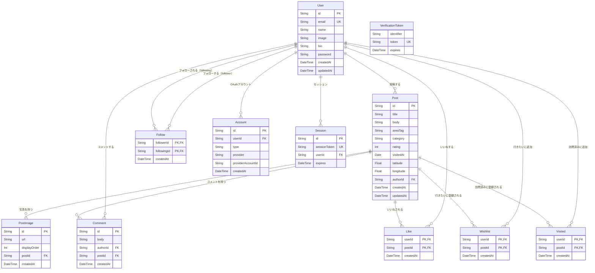

# TripDiary DB設計書

**バージョン:** 1.0
**作成日:** 2026-06-27
**作成者:** Nakata Saki

---

## 1. 概要

### 1.1 設計方針

- 画像は Cloudinary に保存し、DB には URL のみ保持する
- いいね・フォロー・訪問済み・行きたいリストは複合主キーで一意性を管理する
- タイムスタンプは `createdAt` / `updatedAt` を全テーブルに持つ（`updatedAt` は変更があるテーブルのみ）
- 認証テーブル（Account・Session・VerificationToken）は Auth.js v5 の仕様に準拠する
- 地図用の緯度・経度は Post テーブルに `latitude` / `longitude` として保持する（未定：実装時に確定）

---

## 2. ER 図

---

## 3. テーブル定義書

### 3.1 users テーブル

| カラム名 | 型 | NULL | デフォルト | 説明 |
|---------|-----|------|-----------|------|
| id | VARCHAR(30) | NOT NULL | cuid() | ユーザーID（cuid） |
| email | VARCHAR(255) | NOT NULL | - | メールアドレス（一意） |
| name | VARCHAR(100) | NOT NULL | - | 表示名 |
| image | TEXT | NULL | - | プロフィール画像URL（Cloudinary） |
| bio | VARCHAR(200) | NULL | - | 自己紹介文 |
| password | VARCHAR(255) | NULL | - | ハッシュ化済みパスワード（OAuth利用時はNULL） |
| createdAt | DATETIME(3) | NOT NULL | now() | 作成日時 |
| updatedAt | DATETIME(3) | NOT NULL | - | 更新日時 |

**制約**
- 主キー：`id`
- 一意制約：`email`

**インデックス**
| インデックス名 | カラム | 目的 |
|-------------|-------|------|
| users_email_key | email | メールアドレスによる検索 |

---

### 3.2 posts テーブル

| カラム名 | 型 | NULL | デフォルト | 説明 |
|---------|-----|------|-----------|------|
| id | VARCHAR(30) | NOT NULL | cuid() | 投稿ID（cuid） |
| title | VARCHAR(100) | NOT NULL | - | スポット名・タイトル |
| body | TEXT | NOT NULL | - | 感想・説明文 |
| areaTag | VARCHAR(50) | NOT NULL | - | エリアタグ（例：北海道、京都） |
| category | VARCHAR(50) | NULL | - | カテゴリ（観光スポット/グルメ/宿・ホテル/自然/アクティビティ/その他）。アプリレベルで値を制限 |
| rating | INT | NULL | - | 評価（1〜5）。アプリレベルで 1〜5 に制限 |
| visitedAt | DATE | NULL | - | 訪問日 |
| latitude | DOUBLE | NULL | - | 緯度（未定：地図機能実装時に確定） |
| longitude | DOUBLE | NULL | - | 経度（未定：地図機能実装時に確定） |
| authorId | VARCHAR(30) | NOT NULL | - | 投稿者のユーザーID |
| createdAt | DATETIME(3) | NOT NULL | now() | 作成日時 |
| updatedAt | DATETIME(3) | NOT NULL | - | 更新日時 |

**制約**
- 主キー：`id`
- 外部キー：`authorId` → `users.id`（CASCADE DELETE）

**インデックス**
| インデックス名 | カラム | 目的 |
|-------------|-------|------|
| posts_authorId_idx | authorId | ユーザー別投稿一覧取得 |
| posts_areaTag_idx | areaTag | エリアタグ絞り込み |
| posts_category_idx | category | カテゴリ絞り込み |
| posts_rating_idx | rating | 評価絞り込み |
| posts_createdAt_idx | createdAt DESC | 新着順フィード取得 |

---

### 3.3 post_images テーブル

| カラム名 | 型 | NULL | デフォルト | 説明 |
|---------|-----|------|-----------|------|
| id | VARCHAR(30) | NOT NULL | cuid() | 画像ID（cuid） |
| url | TEXT | NOT NULL | - | 画像URL（Cloudinary） |
| displayOrder | INT | NOT NULL | 0 | 表示順序（0始まり）。`order` は SQL 予約語のため `displayOrder` を使用 |
| postId | VARCHAR(30) | NOT NULL | - | 紐付く投稿のID |
| createdAt | DATETIME(3) | NOT NULL | now() | 作成日時 |

**制約**
- 主キー：`id`
- 外部キー：`postId` → `posts.id`（CASCADE DELETE）

**インデックス**
| インデックス名 | カラム | 目的 |
|-------------|-------|------|
| post_images_postId_idx | postId | 投稿別画像取得 |

---

### 3.4 comments テーブル

| カラム名 | 型 | NULL | デフォルト | 説明 |
|---------|-----|------|-----------|------|
| id | VARCHAR(30) | NOT NULL | cuid() | コメントID（cuid） |
| body | TEXT | NOT NULL | - | コメント本文 |
| authorId | VARCHAR(30) | NOT NULL | - | コメント投稿者のユーザーID |
| postId | VARCHAR(30) | NOT NULL | - | 紐付く投稿のID |
| createdAt | DATETIME(3) | NOT NULL | now() | 作成日時 |

**制約**
- 主キー：`id`
- 外部キー：`authorId` → `users.id`（CASCADE DELETE）
- 外部キー：`postId` → `posts.id`（CASCADE DELETE）

**インデックス**
| インデックス名 | カラム | 目的 |
|-------------|-------|------|
| comments_postId_idx | postId | 投稿別コメント取得 |

---

### 3.5 likes テーブル

| カラム名 | 型 | NULL | デフォルト | 説明 |
|---------|-----|------|-----------|------|
| userId | VARCHAR(30) | NOT NULL | - | いいねしたユーザーID |
| postId | VARCHAR(30) | NOT NULL | - | いいねされた投稿ID |
| createdAt | DATETIME(3) | NOT NULL | now() | いいね日時 |

**制約**
- 複合主キー：`(userId, postId)`
- 外部キー：`userId` → `users.id`（CASCADE DELETE）
- 外部キー：`postId` → `posts.id`（CASCADE DELETE）

---

### 3.6 follows テーブル

| カラム名 | 型 | NULL | デフォルト | 説明 |
|---------|-----|------|-----------|------|
| followerId | VARCHAR(30) | NOT NULL | - | フォローするユーザーID |
| followingId | VARCHAR(30) | NOT NULL | - | フォローされるユーザーID |
| createdAt | DATETIME(3) | NOT NULL | now() | フォロー日時 |

**制約**
- 複合主キー：`(followerId, followingId)`
- 外部キー：`followerId` → `users.id`（CASCADE DELETE）
- 外部キー：`followingId` → `users.id`（CASCADE DELETE）
- 自己フォロー禁止：Prisma は CHECK 制約をサポートしないため、Route Handler のバリデーションでアプリレベルで対応する（`followerId !== followingId` を検証）

---

### 3.7 wishlists テーブル（行きたいリスト）

| カラム名 | 型 | NULL | デフォルト | 説明 |
|---------|-----|------|-----------|------|
| userId | VARCHAR(30) | NOT NULL | - | 登録したユーザーID |
| postId | VARCHAR(30) | NOT NULL | - | 登録された投稿ID |
| createdAt | DATETIME(3) | NOT NULL | now() | 登録日時 |

**制約**
- 複合主キー：`(userId, postId)`
- 外部キー：`userId` → `users.id`（CASCADE DELETE）
- 外部キー：`postId` → `posts.id`（CASCADE DELETE）

---

### 3.8 visited テーブル（訪問済みリスト）

| カラム名 | 型 | NULL | デフォルト | 説明 |
|---------|-----|------|-----------|------|
| userId | VARCHAR(30) | NOT NULL | - | 登録したユーザーID |
| postId | VARCHAR(30) | NOT NULL | - | 登録された投稿ID |
| createdAt | DATETIME(3) | NOT NULL | now() | 登録日時 |

**制約**
- 複合主キー：`(userId, postId)`
- 外部キー：`userId` → `users.id`（CASCADE DELETE）
- 外部キー：`postId` → `posts.id`（CASCADE DELETE）

---

### 3.9 accounts テーブル（Auth.js v5 用）

| カラム名 | 型 | NULL | デフォルト | 説明 |
|---------|-----|------|-----------|------|
| id | VARCHAR(30) | NOT NULL | cuid() | アカウントID |
| userId | VARCHAR(30) | NOT NULL | - | ユーザーID |
| type | VARCHAR(50) | NOT NULL | - | アカウント種別（oauth / credentials） |
| provider | VARCHAR(50) | NOT NULL | - | プロバイダ名 |
| providerAccountId | VARCHAR(255) | NOT NULL | - | プロバイダ側のアカウントID |
| refresh_token | TEXT | NULL | - | リフレッシュトークン |
| access_token | TEXT | NULL | - | アクセストークン |
| expires_at | INT | NULL | - | トークン有効期限 |
| token_type | VARCHAR(50) | NULL | - | トークン種別 |
| scope | TEXT | NULL | - | スコープ |
| id_token | TEXT | NULL | - | ID トークン |
| session_state | TEXT | NULL | - | セッション状態 |

**制約**
- 主キー：`id`
- 一意制約：`(provider, providerAccountId)`
- 外部キー：`userId` → `users.id`（CASCADE DELETE）

---

### 3.10 sessions テーブル（Auth.js v5 用）

| カラム名 | 型 | NULL | デフォルト | 説明 |
|---------|-----|------|-----------|------|
| id | VARCHAR(30) | NOT NULL | cuid() | セッションID |
| sessionToken | VARCHAR(255) | NOT NULL | - | セッショントークン（一意） |
| userId | VARCHAR(30) | NOT NULL | - | ユーザーID |
| expires | DATETIME(3) | NOT NULL | - | セッション有効期限 |

**制約**
- 主キー：`id`
- 一意制約：`sessionToken`
- 外部キー：`userId` → `users.id`（CASCADE DELETE）

---

### 3.11 verification_tokens テーブル（Auth.js v5 用）

| カラム名 | 型 | NULL | デフォルト | 説明 |
|---------|-----|------|-----------|------|
| identifier | VARCHAR(255) | NOT NULL | - | 識別子（メールアドレス等） |
| token | VARCHAR(255) | NOT NULL | - | 検証トークン（一意） |
| expires | DATETIME(3) | NOT NULL | - | トークン有効期限 |

**制約**
- 複合一意制約：`(identifier, token)`

---

## 4. 関連ドキュメント

| ドキュメント名 | ファイル |
|--------------|---------|
| 要件定義書 | [要件定義書.md](要件定義書.md) |
| API 仕様書 | [API仕様書.md](API仕様書.md) |
