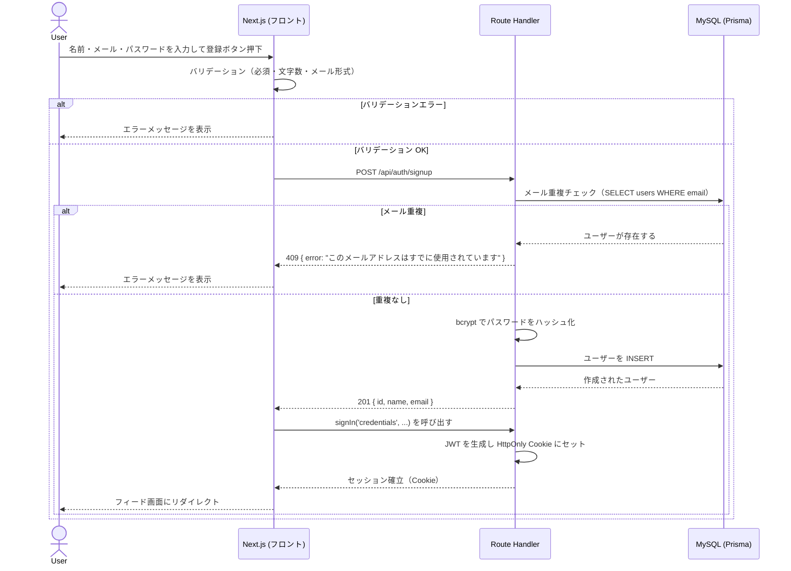
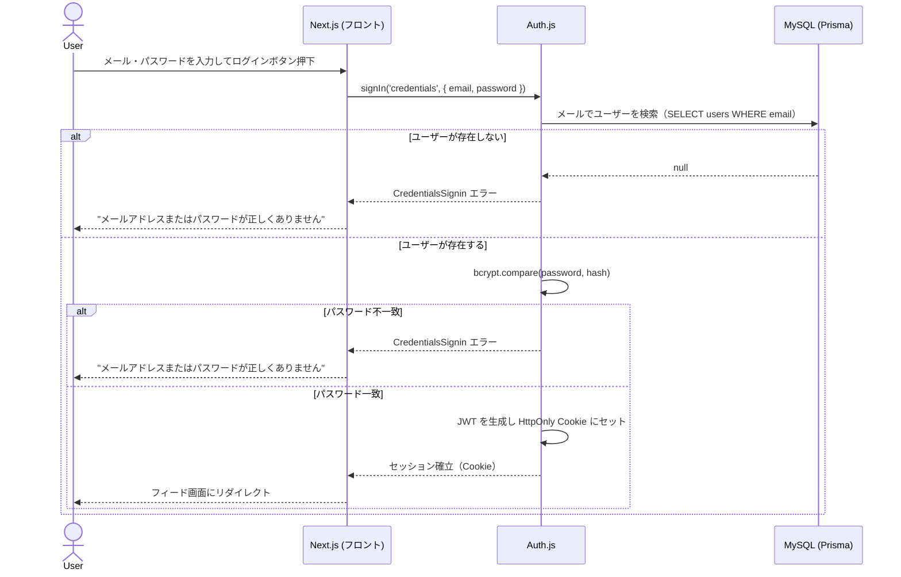
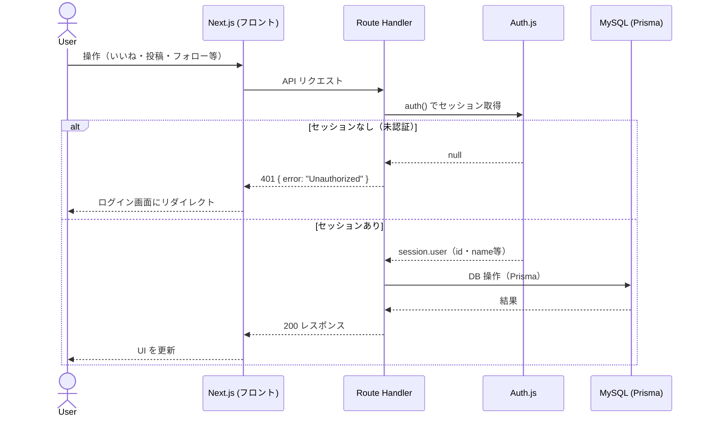
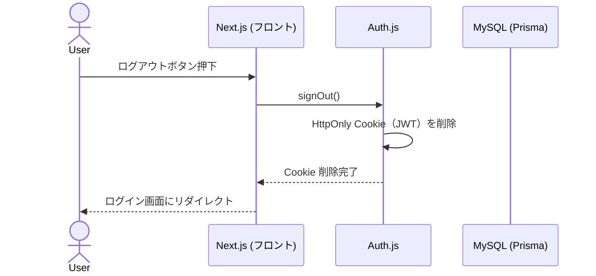
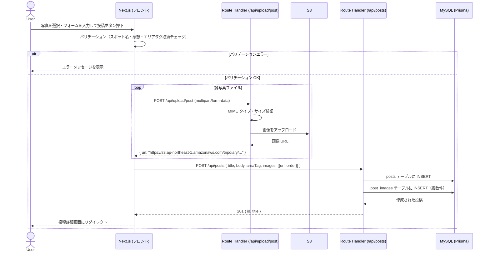
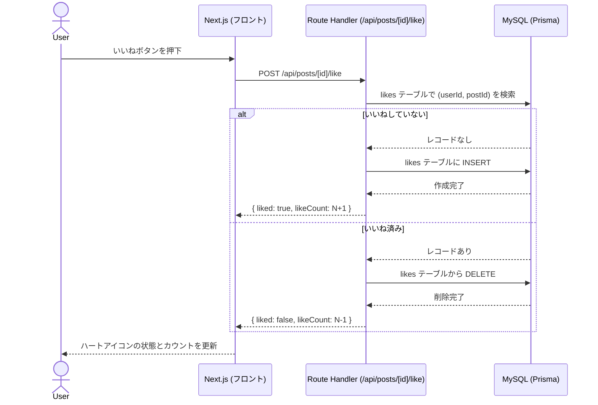
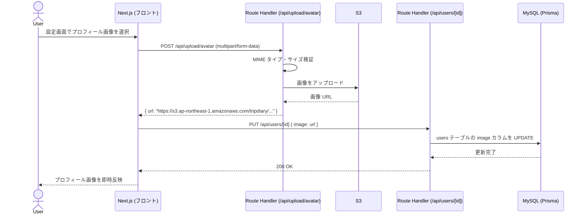
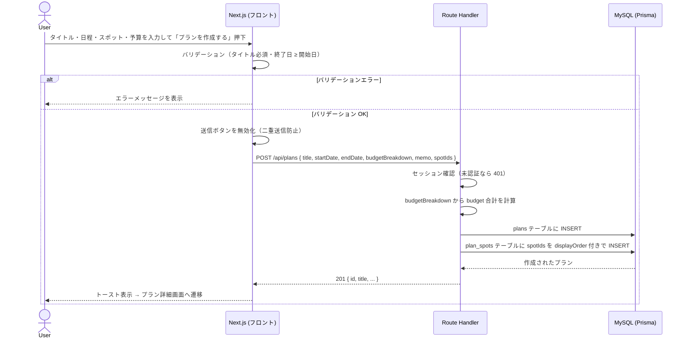
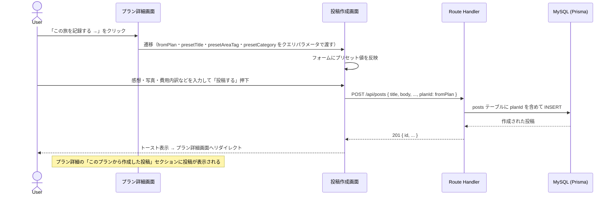
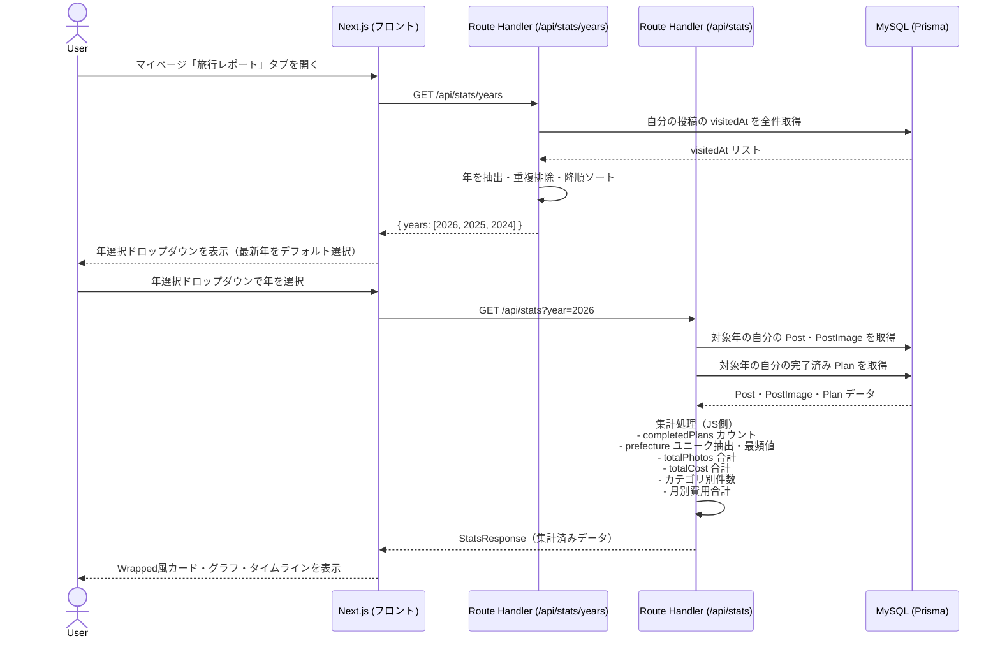

# TripDiary シーケンス図

**バージョン:** 1.2
**作成日:** 2026-06-27
**更新日:** 2026-06-28
**作成者:** Nakata Saki

---

## 概要

本ドキュメントでは、主要な操作フローを Mermaid シーケンス図で示す。

### 前提知識：認証セッション

| 項目 | 仕様 |
|------|------|
| 認証方式 | Auth.js v5 JWT Strategy（HttpOnly Cookie に署名済み JWT を保存） |
| セッション取得 | `auth()` をサーバーサイドで呼び出す |
| セッション保存先 | HttpOnly Cookie（DB への書き込みなし） |
| セッション有効期限 | 30日（アクティブ利用中は毎日自動延長） |

---

## 1. ユーザー登録

---

## 2. ログイン

---

## 3. 認証済み API リクエスト

---

## 4. ログアウト

---

## 5. 投稿作成（写真アップロード含む）

---

## 6. いいね toggle

---

## 7. プロフィール画像アップロード

---

## 8. 旅行プラン作成

---

## 9. 「この旅を記録する」フロー

---

## 10. 旅行レポート取得

---

## 11. 関連ドキュメント

| ドキュメント | ファイル |
|------------|---------|
| 要件定義書 | [要件定義書.md](要件定義書.md) |
| API 仕様書 | [API仕様書.md](API仕様書.md) |
| 認証機能定義書 | [機能定義書/認証機能定義書.md](機能定義書/認証機能定義書.md) |
| 旅行プラン機能定義書 | [機能定義書/旅行プラン機能定義書.md](機能定義書/旅行プラン機能定義書.md) |
| 旅行レポート機能定義書 | [機能定義書/旅行レポート機能定義書.md](機能定義書/旅行レポート機能定義書.md) |
