# TripDiary 画面遷移図

**バージョン:** 1.2
**作成日:** 2026-06-27
**更新日:** 2026-06-28
**作成者:** Nakata Saki

---

## 1. 画面遷移図

```mermaid
graph TD
    Start([アクセス]) --> Explore[S-03 探索]

    Explore -->|ログインリンク| Login[S-01 ログイン]
    Explore -->|投稿カードをクリック| PostDetail[S-04 投稿詳細]
    Explore -->|アバター / 名前をクリック| UserProfile[S-07 ユーザープロフィール]
    Explore -->|エリアタグをクリック| TagPage[S-08 エリアタグ絞り込み]
    Explore -->|検索アイコン| Search[S-11 ユーザー検索]

    Login -->|ログイン成功| Explore
    Login -->|新規登録リンク| Signup[S-02 新規登録]
    Signup -->|登録成功| Explore
    Signup -->|ログインリンク| Login

    Mypage[S-10 マイページ] -->|投稿カードをクリック| PostDetail
    Mypage -->|投稿作成ボタン| PostNew[S-05 投稿作成]
    Mypage -->|アバター / 名前をクリック| UserProfile
    Mypage -->|旅行プランカードをクリック| PlanDetail[S-14 旅行プラン詳細]
    Mypage -->|新しいプランを作成| PlanNew[S-15 旅行プラン作成]
    Mypage -->|サイドバー「旅行レポート」| Report[S-17 旅行レポート]
    Report -->|投稿タイムラインをクリック| PostDetail

    AnyAuth([認証済み画面]) -->|サイドバー「通知」| Notification[S-12 通知]
    AnyAuth -->|サイドバー各タブ| Mypage
    AnyAuth -->|サイドバー「旅行レポート」| Report
    AnyAuth -->|サイドバー「ホーム」| Home[S-18 ホーム]
    Home -->|投稿カードをクリック| PostDetail
    Home -->|アバター / 名前をクリック| UserProfile
    Home -->|フォロー中なし「ユーザーを探す」| Search[S-11 総合検索]

    PostDetail -->|ブラウザ戻るボタン| PrevPage[遷移元の画面]
    PostDetail -->|編集ボタン（本人のみ）| PostEdit[S-06 投稿編集]
    PostDetail -->|削除ボタン（本人のみ）→ 確認後| PrevPage
    PostDetail -->|アバター / 名前をクリック| UserProfile
    PostDetail -->|エリアタグをクリック| TagPage

    PostNew -->|投稿成功（通常）| PostDetail
    PostNew -->|投稿成功（旅行プランから）| PlanDetail
    PostNew -->|キャンセル| PrevPage

    PostEdit -->|更新成功| PostDetail
    PostEdit -->|キャンセル| PostDetail

    PlanDetail -->|編集ボタン| PlanEdit[S-16 旅行プラン編集]
    PlanDetail -->|この旅を記録する| PostNew
    PlanDetail -->|削除 → 確認後| Mypage

    PlanNew -->|作成成功| PlanDetail
    PlanEdit -->|保存成功| PlanDetail

    UserProfile -->|投稿カードをクリック| PostDetail
    UserProfile -->|エリアタグをクリック| TagPage
    UserProfile -->|設定リンク（自分のみ）| Settings[S-09 設定]

    TagPage -->|投稿カードをクリック| PostDetail

    Settings -->|保存成功| UserProfile
    Settings -->|キャンセル| UserProfile
    Settings -->|ログアウト| Explore

    Search -->|ユーザーカードをクリック| UserProfile
```

---

## 2. 認証ガードの方針

| URL パターン | 未認証時の挙動 |
|------------|-------------|
| `/` | そのまま表示（探索ページは公開） |
| `/posts/[id]` | そのまま表示（閲覧のみ） |
| `/users/[id]` | そのまま表示（閲覧のみ） |
| `/tags/[tag]` | そのまま表示 |
| `/search` | そのまま表示 |
| `/mypage` | `/login` にリダイレクト |
| `/mypage?tab=report` | `/login` にリダイレクト |
| `/dashboard` | `/login` にリダイレクト |
| `/plans/[id]` | `/login` にリダイレクト |
| `/plans/new` | `/login` にリダイレクト |
| `/posts/new` | `/login` にリダイレクト |
| `/posts/[id]/edit` | `/login` にリダイレクト |
| `/settings` | `/login` にリダイレクト |

---

## 3. 画面遷移ルール一覧

| # | 出発画面 | トリガー | 遷移先 |
|---|---------|---------|--------|
| 1 | どこからでも | 未認証で保護ルート（/dashboard 等）にアクセス | S-01 ログイン |
| 2 | S-01 ログイン | ログイン成功 | S-03 探索 |
| 3 | S-01 ログイン | 新規登録リンクをクリック | S-02 新規登録 |
| 4 | S-02 新規登録 | 登録成功 | S-03 探索 |
| 5 | S-02 新規登録 | ログインリンクをクリック | S-01 ログイン |
| 6 | S-03 探索 | 投稿カードをクリック | S-04 投稿詳細 |
| 7 | S-03 探索 | 投稿作成ボタンをクリック（要認証） | S-05 投稿作成 |
| 8 | S-03 探索 | アバター / 名前をクリック | S-07 ユーザープロフィール |
| 9 | S-03 探索 | エリアタグをクリック | S-08 エリアタグ絞り込み |
| 10 | S-03 探索 | 検索アイコン | S-11 ユーザー検索 |
| 11 | S-03 探索 | ナビ「フォロー中の投稿」をクリック（要認証） | S-10 マイページ（フォロー中タブ） |
| 11a | 認証済み全画面 | サイドバーの各マイページタブをクリック | S-10 マイページ（対応タブ） |
| 11b | 認証済み全画面 | サイドバー「旅行レポート」をクリック | S-17 旅行レポート |
| 11c | 認証済み全画面 | サイドバー「通知」をクリック | S-12 通知 |
| 12 | S-10 マイページ | 投稿カードをクリック | S-04 投稿詳細 |
| 13 | S-10 マイページ | 旅行プランカードをクリック | S-14 旅行プラン詳細 |
| 14 | S-10 マイページ | 新しいプランを作成 | S-15 旅行プラン作成 |
| 15 | S-10 マイページ | アバター / 名前をクリック | S-07 ユーザープロフィール |
| 16 | S-04 投稿詳細 | ブラウザ戻るボタン | 遷移元の画面 |
| 17 | S-04 投稿詳細 | 編集ボタン（本人のみ） | S-06 投稿編集 |
| 18 | S-04 投稿詳細 | 削除ボタン（本人のみ）→ 確認後 | 遷移元の画面 |
| 19 | S-04 投稿詳細 | アバター / 名前をクリック | S-07 ユーザープロフィール |
| 20 | S-04 投稿詳細 | エリアタグをクリック | S-08 エリアタグ絞り込み |
| 21 | S-05 投稿作成 | 投稿成功（通常） | S-04 投稿詳細 |
| 22 | S-05 投稿作成 | 投稿成功（旅行プランから） | S-14 旅行プラン詳細 |
| 23 | S-05 投稿作成 | キャンセル | 遷移元の画面 |
| 24 | S-06 投稿編集 | 更新成功 | S-04 投稿詳細 |
| 25 | S-06 投稿編集 | キャンセル | S-04 投稿詳細 |
| 26 | S-07 プロフィール | 投稿カードをクリック | S-04 投稿詳細 |
| 27 | S-07 プロフィール | エリアタグをクリック | S-08 エリアタグ絞り込み |
| 28 | S-07 プロフィール | 設定リンク（自分のみ） | S-09 設定 |
| 29 | S-08 エリアタグ絞り込み | 投稿カードをクリック | S-04 投稿詳細 |
| 30 | S-09 設定 | 保存成功 | S-07 ユーザープロフィール |
| 31 | S-09 設定 | キャンセル | S-07 ユーザープロフィール |
| 32 | S-09 設定 | ログアウト | S-03 探索 |
| 33 | S-11 総合検索 | ユーザーカードをクリック | S-07 ユーザープロフィール |
| 33a | S-11 総合検索 | 旅スポットカードをクリック | S-04 投稿詳細 |
| 41 | S-18 ホーム | 投稿カードをクリック | S-04 投稿詳細 |
| 42 | S-18 ホーム | アバター / 名前をクリック | S-07 ユーザープロフィール |
| 43 | S-18 ホーム | フォロー中なし「ユーザーを探す」 | S-11 総合検索 |
| 44 | 認証済み全画面 | サイドバー「ホーム」をクリック | S-18 ホーム |
| 34 | S-14 旅行プラン詳細 | 編集ボタン | S-16 旅行プラン編集 |
| 35 | S-14 旅行プラン詳細 | この旅を記録する | S-05 投稿作成（プリセット付き） |
| 36 | S-14 旅行プラン詳細 | 削除 → 確認後 | S-10 マイページ |
| 37 | S-15 旅行プラン作成 | 作成成功 | S-14 旅行プラン詳細 |
| 38 | S-16 旅行プラン編集 | 保存成功 | S-14 旅行プラン詳細 |
| 39 | S-10 マイページ | サイドバー「旅行レポート」をクリック | S-17 旅行レポート |
| 40 | S-17 旅行レポート | 年別タイムラインの投稿をクリック | S-04 投稿詳細 |

---

## 3. 関連ドキュメント

| ドキュメント | ファイル |
|------------|---------|
| 要件定義書 | [要件定義書.md](要件定義書.md) |
| 画面設計書 | [画面設計書.md](画面設計書.md) |
