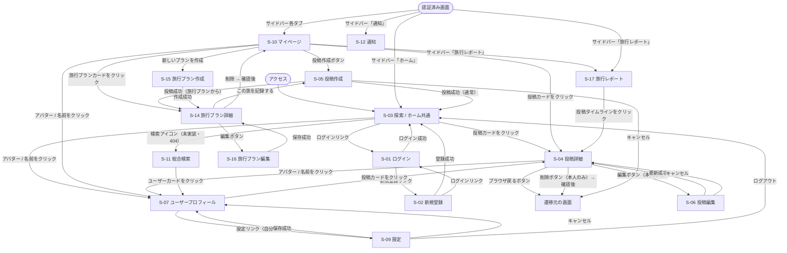

# TripDiary 画面遷移図

**バージョン:** 1.3
**作成日:** 2026-06-27
**更新日:** 2026-07-04
**作成者:** Nakata Saki

---

## 1. 画面遷移図

> ⚠️ **S-18「ホーム」ノードは廃止。** `/dashboard` は `/`（S-03 探索）へリダイレクトするだけのスタブになっており、S-03 と同一画面。以下の図ではログイン後の遷移先を `Explore`（S-03）に統合している。
> また S-08（エリア絞り込み）・S-11（総合検索）は Phase 3-D 未実装のため、遷移先として記載しているが実際には404になる（サイドバー・投稿カードのリンクは残存）。

---

## 2. 認証ガードの方針

| URL パターン | 未認証時の挙動 |
|------------|-------------|
| `/` | そのまま表示（探索ページは公開） |
| `/posts/[id]` | そのまま表示（閲覧のみ） |
| `/users/[id]` | そのまま表示（閲覧のみ） |
| `/tags/[tag]` | 未実装（Phase 3-D 予定）。現状ページ自体が存在せず404 |
| `/search` | 未実装（Phase 3-D 予定）。現状ページ自体が存在せず404 |
| `/mypage` | `/login` にリダイレクト |
| `/mypage?tab=report` | `/login` にリダイレクト |
| `/dashboard` | 認証不要。誰でも `/` にリダイレクトされる（`/login` へは飛ばない） |
| `/plans/[id]` | `/login` にリダイレクト |
| `/plans/new` | `/login` にリダイレクト |
| `/posts/new` | `/login` にリダイレクト |
| `/posts/[id]/edit` | `/login` にリダイレクト |
| `/settings` | `/login` にリダイレクト |

---

## 3. 画面遷移ルール一覧

| # | 出発画面 | トリガー | 遷移先 |
|---|---------|---------|--------|

> 番号は付番当時のまま維持しており、S-18（ホーム）廃止・S-08/S-11（エリア絞り込み/総合検索）未実装に伴い削除したルールは欠番（20, 27, 29, 33, 33a, 41〜44）。

| 1 | どこからでも | 未認証で保護ルート（/mypage, /posts/new 等。`/dashboard` は認証不要） にアクセス | S-01 ログイン |
| 2 | S-01 ログイン | ログイン成功 | S-03 探索（`/`。S-18 は廃止、`/dashboard` は `/` へのリダイレクトのみ） |
| 3 | S-01 ログイン | 新規登録リンクをクリック | S-02 新規登録 |
| 4 | S-02 新規登録 | 登録成功 | S-03 探索 |
| 5 | S-02 新規登録 | ログインリンクをクリック | S-01 ログイン |
| 6 | S-03 探索 | 投稿カードをクリック | S-04 投稿詳細 |
| 7 | S-03 探索 | 投稿作成ボタンをクリック（要認証） | S-05 投稿作成 |
| 8 | S-03 探索 | アバター / 名前をクリック | S-07 ユーザープロフィール |
| 9 | S-03 探索 | エリアカードをクリック | 未実装（S-08 は Phase 3-D 予定、現状クリックしても遷移しない） |
| 10 | S-03 探索 | 検索アイコン | 未実装（S-11 は Phase 3-D 予定、現状404） |
| 11 | S-03 探索 | ナビ「フォロー中の投稿」をクリック（要認証） | S-10 マイページ（フォロー中タブ） |
| 11a | 認証済み全画面 | サイドバーの各マイページタブをクリック | S-10 マイページ（対応タブ） |
| 11b | 認証済み全画面 | サイドバー「旅行レポート」をクリック | S-17 旅行レポート |
| 11c | 認証済み全画面 | サイドバー「通知」をクリック | S-12 通知 |
| 12 | S-10 マイページ | 投稿カードをクリック | S-04 投稿詳細 |
| 13 | S-10 マイページ | 旅行プランカードをクリック | S-14 旅行プラン詳細 |
| 14 | S-10 マイページ | 新しいプランを作成 | S-15 旅行プラン作成 |
| 15 | S-10 マイページ | アバター / 名前をクリック | S-07 ユーザープロフィール |
| 16 | S-04 投稿詳細 | ブラウザ戻るボタン | 遷移元の画面 |
| 17 | S-04 投稿詳細 | 編集ボタン（本人のみ） | S-06 投稿編集 |
| 18 | S-04 投稿詳細 | 削除ボタン（本人のみ）→ 確認後 | 遷移元の画面 |
| 19 | S-04 投稿詳細 | アバター / 名前をクリック | S-07 ユーザープロフィール |
| 21 | S-05 投稿作成 | 投稿成功（通常） | S-03 探索（`/`） |
| 22 | S-05 投稿作成 | 投稿成功（旅行プランから） | S-14 旅行プラン詳細 |
| 23 | S-05 投稿作成 | キャンセル | 遷移元の画面 |
| 24 | S-06 投稿編集 | 更新成功 | S-04 投稿詳細 |
| 25 | S-06 投稿編集 | キャンセル | S-04 投稿詳細 |
| 26 | S-07 プロフィール | 投稿カードをクリック | S-04 投稿詳細 |
| 28 | S-07 プロフィール | 設定リンク（自分のみ） | S-09 設定 |
| 30 | S-09 設定 | 保存成功 | S-07 ユーザープロフィール |
| 31 | S-09 設定 | キャンセル | S-07 ユーザープロフィール |
| 32 | S-09 設定 | ログアウト | S-03 探索 |
| 34 | S-14 旅行プラン詳細 | 編集ボタン | S-16 旅行プラン編集 |
| 35 | S-14 旅行プラン詳細 | この旅を記録する | S-05 投稿作成（プリセット付き） |
| 36 | S-14 旅行プラン詳細 | 削除 → 確認後 | S-10 マイページ |
| 37 | S-15 旅行プラン作成 | 作成成功 | S-14 旅行プラン詳細 |
| 38 | S-16 旅行プラン編集 | 保存成功 | S-14 旅行プラン詳細 |
| 39 | S-10 マイページ | サイドバー「旅行レポート」をクリック | S-17 旅行レポート |
| 40 | S-17 旅行レポート | 年別タイムラインの投稿をクリック | S-04 投稿詳細 |

---

## 3. 関連ドキュメント

| ドキュメント | ファイル |
|------------|---------|
| 要件定義書 | [要件定義書.md](要件定義書.md) |
| 画面設計書 | [画面設計書.md](画面設計書.md) |
