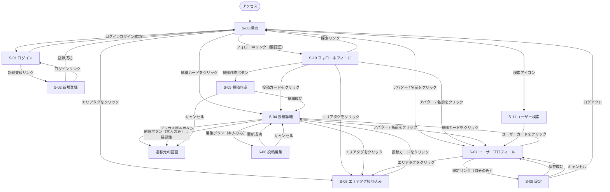

# TripDiary 画面遷移図

**バージョン:** 1.0
**作成日:** 2026-06-27
**作成者:** Nakata Saki

---

## 1. 画面遷移図

---

## 2. 認証ガードの方針

| URL パターン | 未認証時の挙動 |
|------------|-------------|
| `/` | そのまま表示（探索ページは公開） |
| `/posts/[id]` | そのまま表示（閲覧のみ） |
| `/users/[id]` | そのまま表示（閲覧のみ） |
| `/tags/[tag]` | そのまま表示 |
| `/search` | そのまま表示 |
| `/home` | `/login` にリダイレクト |
| `/posts/new` | `/login` にリダイレクト |
| `/posts/[id]/edit` | `/login` にリダイレクト |
| `/settings` | `/login` にリダイレクト |

---

## 3. 画面遷移ルール一覧

| # | 出発画面 | トリガー | 遷移先 |
|---|---------|---------|--------|
| 1 | どこからでも | 未認証で保護ルート（/home 等）にアクセス | S-01 ログイン |
| 2 | S-01 ログイン | ログイン成功 | S-03 探索 |
| 3 | S-01 ログイン | 新規登録リンクをクリック | S-02 新規登録 |
| 4 | S-02 新規登録 | 登録成功 | S-03 探索 |
| 5 | S-02 新規登録 | ログインリンクをクリック | S-01 ログイン |
| 6 | S-03 探索 | 投稿カードをクリック | S-04 投稿詳細 |
| 7 | S-03 探索 | 投稿作成ボタンをクリック（要認証） | S-05 投稿作成 |
| 8 | S-03 探索 | アバター / 名前をクリック | S-07 ユーザープロフィール |
| 9 | S-03 探索 | エリアタグをクリック | S-08 エリアタグ絞り込み |
| 10 | S-03 探索 | 検索アイコン | S-11 ユーザー検索 |
| 11 | S-03 探索 | ナビ「フォロー中」をクリック（要認証） | S-10 フォロー中フィード |
| 12 | S-10 フォロー中フィード | 投稿カードをクリック | S-04 投稿詳細 |
| 13 | S-10 フォロー中フィード | 投稿作成ボタンをクリック | S-05 投稿作成 |
| 14 | S-10 フォロー中フィード | アバター / 名前をクリック | S-07 ユーザープロフィール |
| 15 | S-10 フォロー中フィード | エリアタグをクリック | S-08 エリアタグ絞り込み |
| 16 | S-04 投稿詳細 | ブラウザ戻るボタン | 遷移元の画面 |
| 17 | S-04 投稿詳細 | 編集ボタン（本人のみ） | S-06 投稿編集 |
| 18 | S-04 投稿詳細 | 削除ボタン（本人のみ）→ 確認後 | 遷移元の画面 |
| 19 | S-04 投稿詳細 | アバター / 名前をクリック | S-07 ユーザープロフィール |
| 20 | S-04 投稿詳細 | エリアタグをクリック | S-08 エリアタグ絞り込み |
| 21 | S-05 投稿作成 | 投稿成功 | S-04 投稿詳細 |
| 22 | S-05 投稿作成 | キャンセル | 遷移元の画面 |
| 23 | S-06 投稿編集 | 更新成功 | S-04 投稿詳細 |
| 24 | S-06 投稿編集 | キャンセル | S-04 投稿詳細 |
| 25 | S-07 プロフィール | 投稿カードをクリック | S-04 投稿詳細 |
| 26 | S-07 プロフィール | エリアタグをクリック | S-08 エリアタグ絞り込み |
| 27 | S-07 プロフィール | 設定リンク（自分のみ） | S-09 設定 |
| 28 | S-08 エリアタグ絞り込み | 投稿カードをクリック | S-04 投稿詳細 |
| 29 | S-09 設定 | 保存成功 | S-07 ユーザープロフィール |
| 30 | S-09 設定 | キャンセル | S-07 ユーザープロフィール |
| 31 | S-09 設定 | ログアウト | S-03 探索 |
| 32 | S-11 ユーザー検索 | ユーザーカードをクリック | S-07 ユーザープロフィール |

---

## 3. 関連ドキュメント

| ドキュメント | ファイル |
|------------|---------|
| 要件定義書 | [要件定義書.md](要件定義書.md) |
| 画面設計書 | [画面設計書.md](画面設計書.md) |
