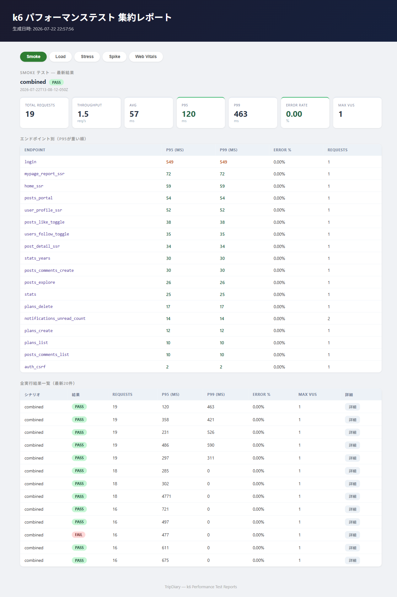

# k6 パフォーマンステスト

Phase 5-B。CIには一切組み込まず、指示があったときのみローカルで手動実行する。

## 前提条件

- k6 v1.0以上がインストールされていること（`k6 version`で確認。TypeScriptのtype-strippingにv1.0以上が必須）
- jq 1.6以上がインストールされていること（集約レポートのJSON抽出・ソートに使用）
- Docker Desktop が起動していること
- `pnpm dev`（開発サーバー）を停止していること（3000番ポートを空ける）

Windowsは`winget install jqlang.jq`、macOSは`brew install jq`、Ubuntu/Debianは`sudo apt-get install jq`で導入できる。`run.sh`は実行前にjqの有無を確認し、未導入なら負荷試験を開始せず終了する。

## 実行手順

```bash
# 1. perf専用DB（mysql-perf、ポート3308）を起動してマイグレーション
pnpm perf:up
pnpm perf:migrate

# 2. シードデータを投入（何度でも再実行可能。既存データを削除してから再投入する）
pnpm perf:seed

# 3. 別ターミナルでperf専用ビルド・起動（.env.perfを使用）
pnpm perf:build
pnpm perf:start

# 4. k6テストを実行（必ずsmokeを最初に。閾値違反があれば非0で終了する）
pnpm perf:smoke   # スモークテスト（約1分）
pnpm perf:load    # 通常負荷テスト（約10分）
pnpm perf:stress  # ストレステスト（約12分）
pnpm perf:spike   # スパイクテスト（約8分）

# 5. Playwright（Web Vitals・操作応答時間）
pnpm perf:vitals

# 6. 後片付け（＝クリーンアップ）
pnpm perf:down
```

各k6テストの完了後、`performance/k6/results/index.html`（集約レポート）が自動的に再生成されブラウザで開く。手動で再生成・再表示したい場合は `pnpm perf:report`（`K6_NO_OPEN=1`を付けると自動オープンを抑止できる）。

**クリーンアップについて（TimeLineとの設計差異）**: TimeLineは`run.sh cleanup`が本番相当DBに対して`DELETE FROM users WHERE username LIKE 'perf_user_%'`を明示的に実行していたが、TripDiaryではこの方式をあえて採用していない。`mysql-perf`はtmpfs（メモリ上）のコンテナのため、`pnpm perf:down`（`docker compose stop`）だけで中身が完全に消え、次回`pnpm perf:up`から作り直せば必ずクリーンな状態に戻る。加えて`pnpm perf:seed`自体も毎回全テーブルをTRUNCATEしてから再投入するため、テスト実行後に専用のクリーンアップコマンドを別途叩く必要が無い。「本番相当のDBに対して条件付きDELETEを打つ」というTimeLine方式は、条件（`LIKE`パターン等）を誤ると本番データを巻き込みかねない設計であり、TripDiaryでは意図的に踏襲していない。

## テスト構成

| 種別 | スケジュール | 合否判定 |
|---|---|---|
| Smoke | VU=1、全シナリオ1周（約30秒） | `http_req_failed: rate<0.01` ＋ 第一級エンドポイントのp95/p99閾値。シード後に必ず最初に実行するゲート |
| Load | ramp(0→10VU,3m) → steady(10VU,5m) → rampdown(2m) | `http_req_failed: rate<0.01` ＋ 第一級エンドポイントのp95/p99閾値 |
| Stress | 5→15→30→50VU（各3分） | 判定しない（`passed: null`＝限界点の記録が目的） |
| Spike | 5→40→5（ランプダウン）→5VU定常→60→5（ランプダウン）→5VU定常 | `http_req_failed: rate<0.05` ＋ cooldown1/cooldown2区間のp99閾値（回復確認） |

第一級エンドポイント（`home_ssr`・`post_detail_ssr`・`mypage_report_ssr`・`user_profile_ssr`・`posts_portal`・`posts_explore`・`posts_like_toggle`・`posts_comments_create`・`users_follow_toggle`）のp95/p99閾値は`helpers/thresholds.ts`の`CONFIRMED_ENDPOINT_P95_THRESHOLDS_MS`/`CONFIRMED_ENDPOINT_P99_THRESHOLDS_MS`に確定済み（クリーン再シード後のLoad定常10VU実測にマージン）。それ以外の補助エンドポイントは引き続き計測のみ（非ゲート）。ログインは独立シナリオ（低頻度）で、他エンドポイントのp95/p99を汚染しないよう`endpoint:login`タグで分離して計測する。

**実測結果（2026-07-22、クリーン再シード後の最終確認）**: `toggleLike`/`createComment`/`toggleFollow`のPrisma `P2034`デッドロック未捕捉バグ、および`post.repository.ts`のLIMIT漏れを検出・修正した。Max VUs表示は`peakWorkloadVUs()`（`options.scenarios`から自動算出、`login`用VUは除く）に置き換え済み。perf DBをクリーンな状態に再シードした上でSmoke/Load/Stress/Spikeを最終実行し、Smoke PASS（19件、p95 120ms / p99 463ms）、Load（10VU）PASS（5,680件、エラー率0%、steady p95 670ms / p99 744ms）、Spike（60VU）PASS（11,616件、エラー率0.034%、cooldown1/2 p99 655ms / 603ms）、Stress（50VU）は18,755件・**全体エラー率**0.005%・vu50区間p95 1011ms / p99 1380msで限界点を記録した。Web Vitals・操作応答時間も4列CSV対応後に8件すべて通過している。詳細は`docs/テスト設計書.md`12.11節を参照。

## シナリオ構成（Load/Stress/Spike共通の加重分散）

| シナリオ | 選択確率 | 内容 |
|---|---|---|
| フィード読み取り | 45% | トップページSSR＋探すAPI＋未読通知数 |
| 投稿詳細SSR | 20% | 人気投稿/平均的な投稿を半々で閲覧＋コメント一覧 |
| いいね/コメント | 15% | 人気投稿（ホットな行）に書き込みを集中させ、行ロック競合を意図的に発生させる |
| プランCRUD | 10% | 一覧取得→作成→削除（自己完結、データを肥大化させない） |
| フォロー/プロフィール閲覧 | 5% | 名簿上「次のユーザー」のプロフィールSSRページを閲覧＋フォロートグル |
| mypage report | 5% | 集計系（GROUP BY等）の重いクエリを独立して計測 |

表の確率は1イテレーションで選ぶシナリオの割合であり、HTTPリクエスト比率ではない（各シナリオが発行するリクエスト数は異なる）。区間タグはk6の`scenarios`分割による自動`scenario`タグに委ねている（経過時間からの推定はランピング中に誤タグ付けになるため使わない）。Loadのp95ゲートは、ramp/rampdownを混ぜず10VU定常の`steady`区間だけを対象とする。

各k6実行前に`/api/health`の疎通と**TripDiary由来の**Node.jsプロセス数を確認する。既定で4個を超える場合は再現性を保つため実行を停止する。Cursor/MCPなど無関係なNode.jsプロセスはカウントしない。意図的に上限を超えて実行する場合のみ`PERF_ALLOW_EXTRA_NODE_PROCESSES=1`を指定する。

## シードデータ（`performance/seed.ts`）

| データ | 件数 |
|---|---|
| ユーザー | 60名（`perf_001`〜`perf_060`、共通パスワード） |
| 投稿 | 3,000〜5,000件（偏りのある投稿者分布、直近2年に分散） |
| いいね | 10,000件（`toggleLike`の実関数を使用） |
| コメント | 10,000件（`createComment`の実関数を使用） |
| フォロー | 300件 |
| 通知 | 3,000件（約3割未読） |
| 投稿画像 | 約8割の投稿に1〜3枚（`public/uploads/`の既存画像を再利用。無ければ画像なしで続行し警告を出す） |

`pnpm perf:seed`は`performance/k6/data/{users.csv, sample-post-ids.json}`（gitignore対象）を生成する。`users.csv`は`id,email,password,nickname`の列を持ち、`id`はフォロートグル・他ユーザーのプロフィール閲覧シナリオが「自分以外の対象」を決定的に選ぶために使う。`sample-post-ids.json`の`mostLikedPostId`（最多いいねの投稿）と`samplePostId`（任意の1件）をk6・Playwrightの両方が参照する。

## HTMLレポート

- 個別レポート: `results/combined-{type}-{timestamp}.html`
- 集約レポート: `results/index.html`（Smoke/Load/Stress/Spikeのタブ切り替え、直近20件の履歴、段階別・エンドポイント別の内訳）

Web Vitals・操作応答時間（`e2e/performance/results/`）も同じ集約レポートにタブとして表示される。

集約レポート（Smokeタブ）の例：



`results/`は`.gitignore`対象のため、上記はある時点のスクリーンショットであり自動更新されない。最新の状態を見るには`pnpm perf:report`を実行して`results/index.html`をブラウザで開く。

README掲載用の画像は`pnpm perf:capture`で再生成する。このコマンドはタブのアニメーションと履歴テーブルを撮影時だけ非表示にし、Smoke / Load / Stress / Spike / Web Vitalsの5枚を`docs/images/`へ出力する。

## ディレクトリ構成

```
performance/
  seed.ts                       # シードスクリプト（tsx実行）
  k6/
    tsconfig.json                # types:["k6"]。ルートtsconfigは継承しない
    README.md
    config/config.ts             # BASE_URL（__ENV.BASE_URL || "http://localhost:3000"）
    data/{users.csv,sample-post-ids.json}   # seed.tsが生成（gitignore）
    helpers/{auth.ts,csv.ts,summary.ts,thresholds.ts}
    requests/{pageRequests.ts,apiRequests.ts}
    scenarios/                   # ページ/API単位のシナリオ関数
    simulations/{smoke,load,stress,spike}/main.ts
    results/                     # 出力（gitignore、.gitkeepのみ管理）
    run.sh                       # smoke|load|stress|spike|index
```

## 依存関係

k6の型定義（`@types/k6`）とシード実行用の`tsx`はルートの`devDependencies`に集約している（`performance/k6/package.json`は作らない）。ルート`tsconfig.json`の`exclude`に`performance/k6/**`のみを追加しており、`performance/seed.ts`自体はアプリ本体の型検査対象に残る。k6コードもESLintの検査対象（`eslint.config.mjs`の専用ブロック）に含めている。
